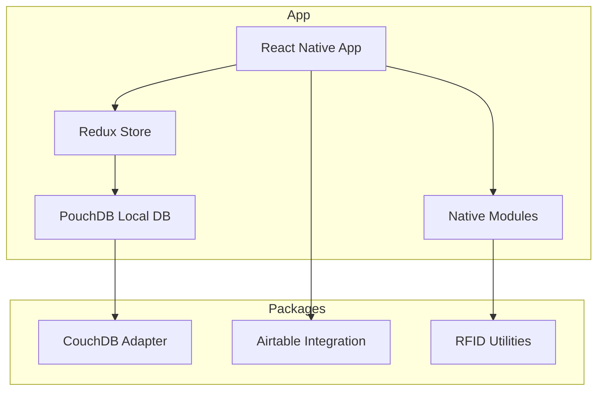
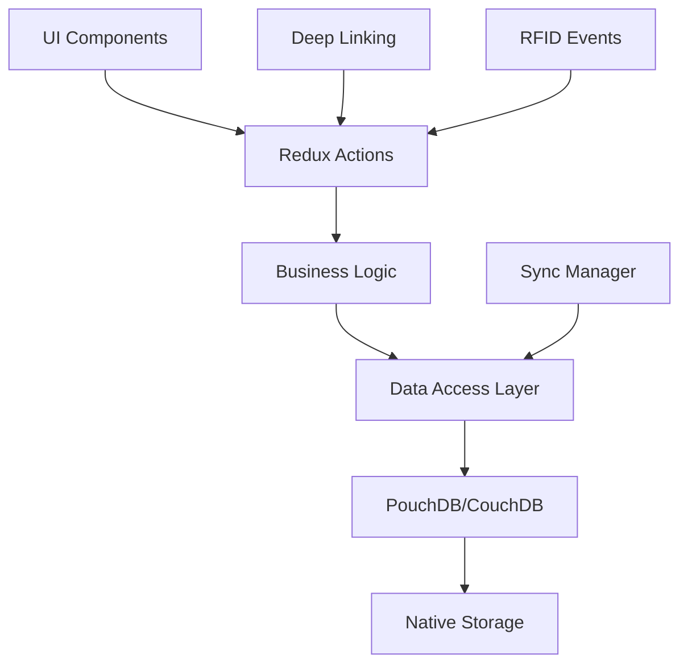
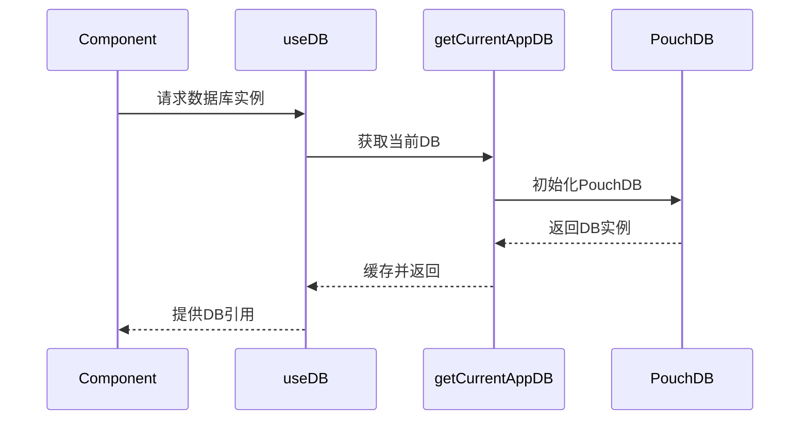
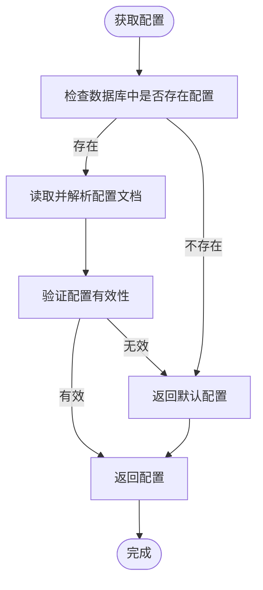
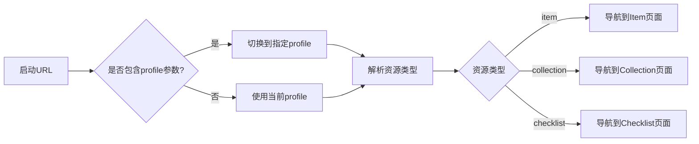
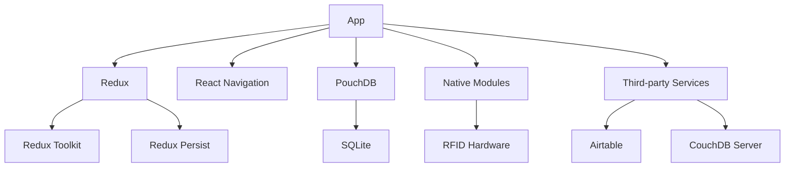

# 项目概述

<cite>
**本文档中引用的文件**  
- [App.tsx](file://App/app/App.tsx)
- [README.md](file://README.md)
- [Navigation.tsx](file://App/app/navigation/Navigation.tsx)
- [MainStack.tsx](file://App/app/navigation/MainStack.tsx)
- [DeveloperToolsScreen.tsx](file://App/app/screens/DeveloperToolsScreen.tsx)
- [DBSyncManager.tsx](file://App/app/features/db-sync/DBSyncManager.tsx)
- [slice.ts](file://App/app/features/profiles/slice.ts)
- [index.ts](file://App/app/features/profiles/index.ts)
- [useDB.ts](file://App/app/db/hooks/useDB.ts)
- [app_db/index.ts](file://App/app/db/app_db/index.ts)
- [configUtils.ts](file://App/app/db/configUtils.ts)
- [CouchDBData.ts](file://packages/data-storage-couchdb/lib/CouchDBData.ts)
- [getGetConfig.ts](file://packages/data-storage-couchdb/lib/functions/getGetConfig.ts)
</cite>

## 目录
1. [简介](#简介)
2. [项目结构](#项目结构)
3. [核心组件](#核心组件)
4. [架构概述](#架构概述)
5. [详细组件分析](#详细组件分析)
6. [依赖分析](#依赖分析)
7. [性能考虑](#性能考虑)
8. [故障排除指南](#故障排除指南)
9. [结论](#结论)

## 简介

Inventory 是一款基于 RFID 技术的资产管理系统，适用于家庭和企业环境。该系统通过 RFID 技术实现物品的快速追踪、库存管理以及定位功能，有效防止物品丢失并提升管理效率。项目采用 React Native 构建跨平台移动应用，结合原生模块处理 RFID 读写器通信等高性能任务。

系统支持与外部数据库（如 CouchDB）同步数据，并提供标签打印、Airtable 集成等扩展功能。用户可通过 TestFlight 或 APK 安装应用，并配合兼容的 UHF RFID 读写器使用完整功能。

**Section sources**
- [README.md](file://README.md#L1-L42)

## 项目结构

项目采用模块化分层架构，主要分为以下几个核心目录：

- `App/`：React Native 移动应用主目录，包含 UI 组件、导航、状态管理等
- `Data/`：数据模式定义与核心数据逻辑
- `packages/`：可复用的共享模块，如数据库适配器、集成服务等
- `Inventory-Docs/`：项目文档，包含使用指南和 API 说明
- `scripts/`：构建和部署脚本

应用层采用 Redux Toolkit 进行状态管理，通过 profiles 模块支持多配置文件切换，每个 profile 对应独立的数据库实例。数据持久化基于 PouchDB 实现本地存储，并支持与远程 CouchDB 服务器同步。

**Diagram sources**
- [App.tsx](file://App/app/App.tsx#L1-L223)
- [store.ts](file://App/app/redux/store.ts#L1-L124)

**Section sources**
- [README.md](file://README.md#L33-L36)

## 核心组件

系统核心由以下几个关键组件构成：

- **App Root**：应用入口，负责初始化 Redux Store、处理启动流程和主题切换
- **Navigation**：基于 React Navigation 的路由系统，管理页面跳转和深层链接
- **DBSyncManager**：数据库同步管理器，处理本地与远程数据库的双向同步
- **Profiles System**：配置文件管理系统，支持多租户数据隔离
- **RFID Modules**：原生模块，处理与 RFID 读写器的蓝牙/UART 通信

这些组件通过 Redux Store 进行状态共享，并利用中间件实现日志记录和状态持久化。

**Section sources**
- [App.tsx](file://App/app/App.tsx#L40-L104)
- [DBSyncManager.tsx](file://App/app/features/db-sync/DBSyncManager.tsx#L1-L152)
- [slice.ts](file://App/app/features/profiles/slice.ts#L1-L527)

## 架构概述

系统采用分层架构设计，从上至下分为表现层、业务逻辑层、数据访问层和持久化层。

应用启动时，首先初始化 Redux Store 并恢复持久化状态。通过 `AppReadyGate` 组件确保数据库就绪后才渲染主界面。Profile 系统管理多个独立的数据环境，每个 profile 拥有独立的数据库命名空间。

**Diagram sources**
- [App.tsx](file://App/app/App.tsx#L107-L214)
- [store.ts](file://App/app/redux/store.ts#L84-L112)

**Section sources**
- [App.tsx](file://App/app/App.tsx#L1-L223)
- [store.ts](file://App/app/redux/store.ts#L1-L124)

## 详细组件分析

### 数据库管理组件

数据库访问通过 hooks 和工具函数封装，提供类型安全的 CRUD 操作。

#### 数据库访问模式

**Diagram sources**
- [useDB.ts](file://App/app/db/hooks/useDB.ts#L1-L80)
- [app_db/index.ts](file://App/app/db/app_db/index.ts#L1-L104)

#### 配置管理
系统配置存储在特殊 ID 的文档中，提供默认值和错误恢复机制。

**Diagram sources**
- [configUtils.ts](file://App/app/db/configUtils.ts#L1-L29)
- [getGetConfig.ts](file://packages/data-storage-couchdb/lib/functions/getGetConfig.ts#L1-L60)

**Section sources**
- [configUtils.ts](file://App/app/db/configUtils.ts#L1-L29)
- [CouchDBData.ts](file://packages/data-storage-couchdb/lib/CouchDBData.ts#L1-L97)

### 导航系统

基于 React Navigation 实现的堆栈导航，支持深层链接处理和动态路由。

**Diagram sources**
- [Navigation.tsx](file://App/app/navigation/Navigation.tsx#L731-L1022)
- [MainStack.tsx](file://App/app/navigation/MainStack.tsx#L251-L313)

**Section sources**
- [Navigation.tsx](file://App/app/navigation/Navigation.tsx#L1-L1022)
- [RootNavigationContext.tsx](file://App/app/navigation/RootNavigationContext.tsx#L1-L17)

## 依赖分析

项目依赖关系呈现清晰的分层结构：

核心依赖包括：
- 状态管理：Redux Toolkit + Redux Persist
- 数据库：PouchDB (本地) + CouchDB (远程)
- 导航：React Navigation
- UI：React Native Paper
- 原生通信：React Native Native Modules

**Diagram sources**
- [package.json](file://App/package.json#L1-L10)
- [package.json](file://packages/data-storage-couchdb/package.json#L1-L10)

**Section sources**
- [package.json](file://App/package.json#L1-L100)
- [package.json](file://packages/data-storage-couchdb/package.json#L1-L50)

## 性能考虑

系统在设计时考虑了多个性能优化点：

1. **数据库连接池**：通过缓存机制避免重复初始化数据库连接
2. **状态选择器优化**：使用 Reselect 创建记忆化选择器
3. **异步操作批处理**：合并多个数据库操作减少 I/O 开销
4. **内存管理**：及时清理不再使用的数据库引用

特别针对数据库初始化过程实现了重试机制，以应对 SQLite 初始化时可能出现的竞争条件。

## 故障排除指南

常见问题及解决方案：

- **启动卡在闪屏页**：检查数据库初始化是否成功，确认 profile 配置完整性
- **同步失败**：验证远程服务器配置，检查网络连接和认证信息
- **RFID 读取异常**：确认蓝牙权限已授予，检查设备兼容性
- **深层链接无效**：确保应用已完全启动后再处理 URL

开发工具页面提供了多个调试入口，包括 EPC 工具、RFID 模块测试等功能。

**Section sources**
- [DeveloperToolsScreen.tsx](file://App/app/screens/DeveloperToolsScreen.tsx#L124-L214)
- [App.tsx](file://App/app/App.tsx#L139-L144)

## 结论

Inventory 项目构建了一个功能完整的 RFID 资产管理系统，采用现代化的前端架构和稳健的数据管理策略。系统通过模块化设计实现了良好的可扩展性，支持多配置文件管理和云端同步。未来可进一步优化数据库查询性能，增强离线使用体验，并扩展更多第三方集成。