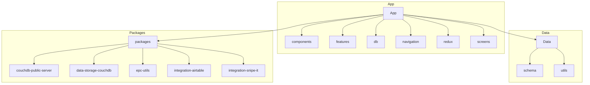
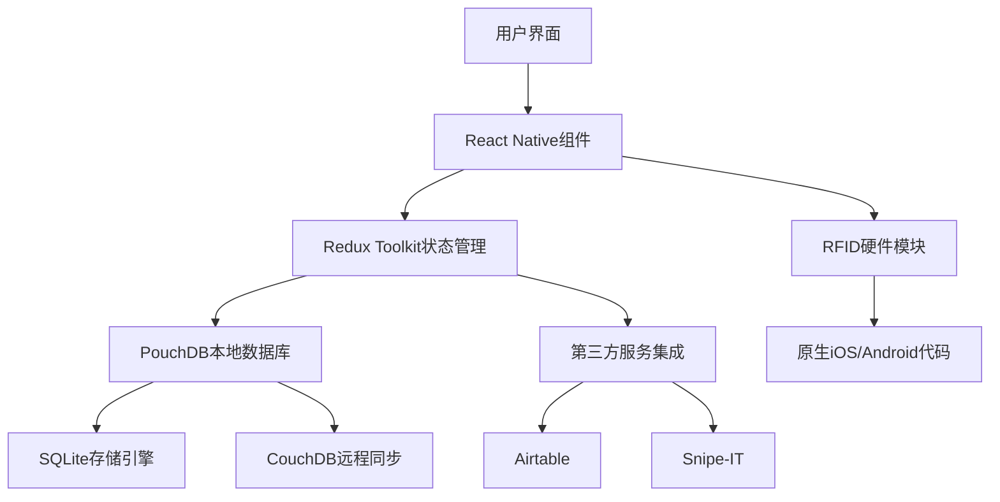
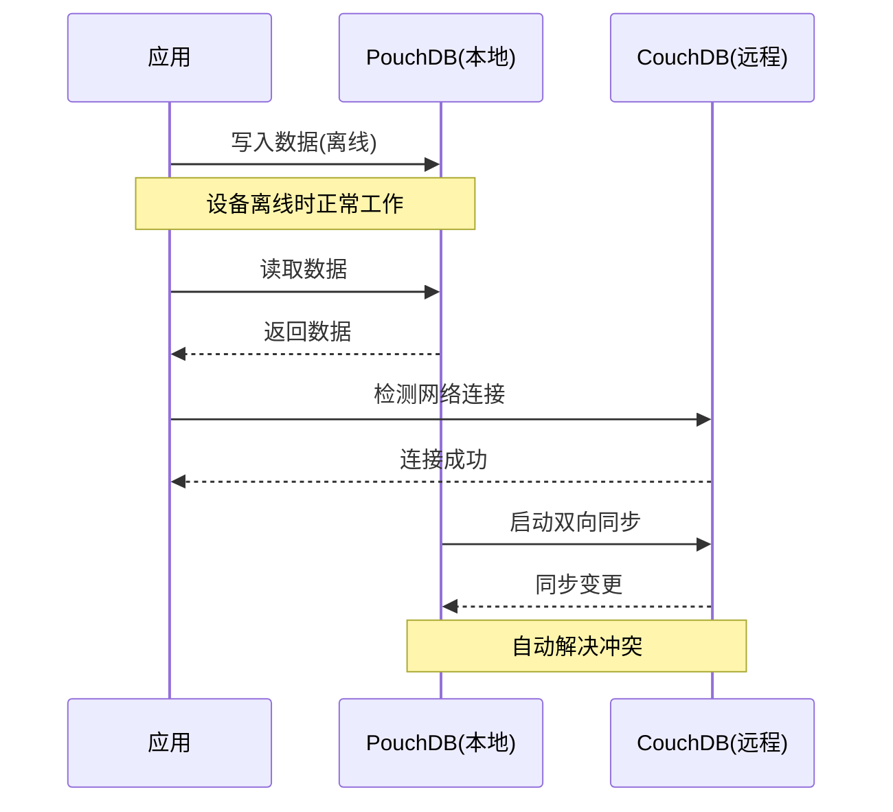
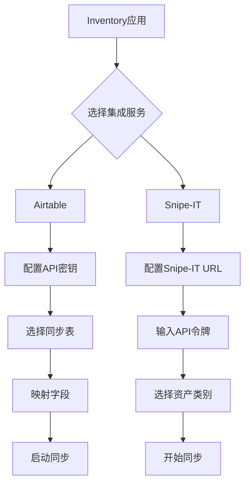

# 项目概述

<cite>
**本文档中引用的文件**  
- [README.md](file://README.md)
- [App.tsx](file://App/app/App.tsx)
- [store.ts](file://App/app/redux/store.ts)
- [pouchdb.ts](file://App/app/db/pouchdb.ts)
- [sqlite.ts](file://App/app/db/sqlite.ts)
- [Navigation.tsx](file://App/app/navigation/Navigation.tsx)
- [MainStack.tsx](file://App/app/navigation/MainStack.tsx)
- [DashboardScreen.tsx](file://App/app/features/inventory/screens/DashboardScreen.tsx)
- [DBSyncManager.tsx](file://App/app/features/db-sync/DBSyncManager.tsx)
- [slice.ts](file://App/app/features/db-sync/slice.ts)
- [slice.ts](file://App/app/features/integrations/slice.ts)
- [AirtableIntegrationScreen.tsx](file://App/app/features/integrations/screens/AirtableIntegrationScreen.tsx)
- [PrintLabelModalScreen.tsx](file://App/app/features/label-printers/screens/PrintLabelModalScreen.tsx)
- [RFIDSheet.tsx](file://App/app/features/rfid/RFIDSheet.tsx)
- [useDB.ts](file://App/app/db/hooks/useDB.ts)
- [configUtils.ts](file://App/app/db/configUtils.ts)
</cite>

## 目录
1. [简介](#简介)
2. [项目结构](#项目结构)
3. [核心功能](#核心功能)
4. [技术栈与架构](#技术栈与架构)
5. [数据同步机制](#数据同步机制)
6. [第三方服务集成](#第三方服务集成)
7. [条码打印功能](#条码打印功能)
8. [RFID标签读写](#rfid标签读写)
9. [目标用户与使用场景](#目标用户与使用场景)

## 简介

Inventory项目是一个基于React Native开发的跨平台库存管理移动应用，旨在为家庭和企业提供高效的RFID资产管理解决方案。通过结合RFID技术，用户可以轻松跟踪物品可用性、防止资产丢失，并在需要时快速定位物品。该项目支持iOS和Android平台，通过TestFlight和APK发布版本，确保广泛的设备兼容性。

该应用的核心价值在于将现代移动开发技术与RFID硬件集成，提供一个无缝的资产追踪体验。用户可以通过直观的界面管理物品、集合、检查清单，并利用RFID读写器进行批量扫描和标签操作。此外，应用还支持与CouchDB的数据同步、Airtable和Snipe-IT等第三方服务的集成，以及条码打印功能，满足多样化的业务需求。

**Section sources**
- [README.md](file://README.md#L1-L42)

## 项目结构

Inventory项目的目录结构清晰地划分为多个模块，便于维护和扩展。主要包含以下几个部分：

- `App/`：React Native iOS/Android应用程序的主目录，包含所有前端代码、组件、导航、状态管理和数据库逻辑。
- `Data/`：数据模式和数据逻辑的集中管理区域，定义了应用的数据结构和验证规则。
- `packages/`：共享模块的集合，包括CouchDB公共服务器、数据存储、EPC工具和第三方集成（如Airtable和Snipe-IT）。
- `scripts/`：自动化脚本，用于依赖安装、补丁应用和构建过程。

在`App/`目录下，进一步细分为`components`（UI组件）、`features`（功能模块）、`db`（数据库相关逻辑）、`navigation`（导航系统）、`redux`（全局状态管理）等子目录，体现了功能分离和模块化设计的原则。

**Diagram sources**
- [README.md](file://README.md#L33-L35)

## 核心功能

Inventory应用提供了一系列强大的核心功能，帮助用户高效管理资产：

- **物品管理**：用户可以创建、编辑和删除物品，记录其名称、描述、数量、位置等信息，并通过图片和RFID标签增强识别能力。
- **集合管理**：支持将物品组织成集合，便于分类和批量操作，例如按房间、项目或部门分组。
- **检查清单**：创建和管理检查清单，用于盘点、审计或维护任务，确保所有项目都被正确处理。
- **RFID标签读写**：集成RFID UHF读写器，支持批量扫描和标签写入，大幅提升库存盘点效率。
- **数据同步（CouchDB）**：通过PouchDB与CouchDB实现本地与远程数据库的双向同步，确保数据一致性并支持离线工作。
- **第三方服务集成**：支持与Airtable和Snipe-IT等外部系统的集成，实现数据互通和自动化工作流。
- **条码打印**：生成并打印条形码标签，方便物理标记和扫描。

这些功能共同构成了一个完整的资产生命周期管理解决方案，从录入、跟踪到维护和报告。

**Section sources**
- [README.md](file://README.md#L3-L18)

## 技术栈与架构

Inventory项目采用了现代化的技术栈，确保高性能、可维护性和跨平台兼容性：

- **React Native**：作为核心框架，实现了iOS和Android应用的统一开发，减少了重复代码和维护成本。
- **Redux Toolkit**：用于全局状态管理，提供可预测的状态更新机制，简化复杂应用的状态逻辑。
- **PouchDB/SQLite**：本地数据存储解决方案，PouchDB提供NoSQL接口，SQLite作为底层存储引擎，确保数据持久化和高效查询。
- **react-navigation**：实现应用内的页面导航和路由管理，支持堆栈、标签和抽屉导航模式。
- **react-native-paper**：提供Material Design风格的UI组件库，确保一致的视觉体验和良好的可访问性。

架构上，应用采用分层设计，前端组件通过Redux与后端数据库交互，DBSyncManager负责协调本地与远程数据库的同步。这种架构不仅提高了代码的可测试性，还增强了系统的可扩展性。

**Diagram sources**
- [App.tsx](file://App/app/App.tsx#L1-L223)
- [store.ts](file://App/app/redux/store.ts)
- [pouchdb.ts](file://App/app/db/pouchdb.ts)
- [sqlite.ts](file://App/app/db/sqlite.ts)

## 数据同步机制

Inventory应用通过PouchDB与CouchDB的集成实现了强大的数据同步功能。PouchDB作为客户端数据库，存储所有本地数据，并在设备离线时继续正常工作。当网络连接恢复时，PouchDB会自动与远程CouchDB服务器进行双向同步，确保数据的一致性和最新性。

同步过程由`DBSyncManager`组件管理，它监听网络状态变化，并根据配置的同步策略执行同步操作。用户可以在设置中添加多个同步服务器，并选择哪些数据需要同步。这种设计不仅支持多设备间的数据共享，还允许团队协作和数据备份。

**Diagram sources**
- [DBSyncManager.tsx](file://App/app/features/db-sync/DBSyncManager.tsx)
- [slice.ts](file://App/app/features/db-sync/slice.ts)

## 第三方服务集成

Inventory应用支持与多种第三方服务的集成，扩展了其功能边界：

- **Airtable集成**：用户可以将库存数据同步到Airtable，利用其强大的表格功能进行数据分析和可视化。集成通过`integration-airtable`包实现，支持双向数据同步和字段映射。
- **Snipe-IT集成**：针对IT资产管理场景，应用支持与Snipe-IT系统的集成，实现资产信息的自动同步，减少手动输入错误。

这些集成通过独立的功能模块实现，位于`features/integrations`目录下，确保核心代码的整洁性。用户可以通过设置界面配置集成参数，如API密钥、同步频率和数据映射规则。

**Diagram sources**
- [slice.ts](file://App/app/features/integrations/slice.ts)
- [AirtableIntegrationScreen.tsx](file://App/app/features/integrations/screens/AirtableIntegrationScreen.tsx)

## 条码打印功能

Inventory应用内置了条码打印功能，允许用户为物品生成并打印条形码标签。这一功能通过`label-printers`功能模块实现，支持多种打印机配置和打印模板。

用户可以选择要打印的物品，预览打印效果，并发送打印任务到已配置的打印机。打印内容可自定义，包括物品名称、ID、二维码或条形码等信息。该功能特别适用于需要物理标签的场景，如仓库管理、设备标识等。

**Section sources**
- [PrintLabelModalScreen.tsx](file://App/app/features/label-printers/screens/PrintLabelModalScreen.tsx)

## RFID标签读写

RFID功能是Inventory应用的核心特色之一。通过集成RFID UHF读写器（如Chainway设备），应用支持批量读取和写入RFID标签，极大地提高了库存盘点的效率。

RFID操作通过原生模块（iOS的Objective-C和Android的Java）实现，确保与硬件的高效通信。React Native层通过`RFIDWithUHFBLEModule`等接口与原生代码交互，提供扫描、写入和批量操作功能。用户界面通过`RFIDSheet`组件提供直观的操作体验，显示扫描结果并允许即时编辑。

**Section sources**
- [RFIDSheet.tsx](file://App/app/features/rfid/RFIDSheet.tsx)
- [modules/RFIDWithUHFBLEModule.ts](file://App/app/modules/RFIDWithUHFBLEModule.ts)

## 目标用户与使用场景

Inventory应用的目标用户主要包括：

- **小型企业主**：管理办公设备、库存商品或租赁资产。
- **家庭用户**：跟踪贵重物品、收藏品或家庭设备。
- **IT管理员**：管理公司IT资产，如电脑、手机和服务器。
- **仓库管理人员**：进行高效的库存盘点和出入库管理。

典型使用场景包括：
- 新物品入库时，通过RFID标签快速登记。
- 定期盘点时，使用RFID读写器批量扫描，比手动输入快数十倍。
- 借出设备时，扫描RFID标签记录借出信息。
- 查找丢失物品时，通过应用定位其最后出现的位置。

这种灵活性和效率的结合，使Inventory成为一个适用于多种环境的强大资产管理工具。

**Section sources**
- [README.md](file://README.md#L3-L18)
- [App.tsx](file://App/app/App.tsx#L1-L223)